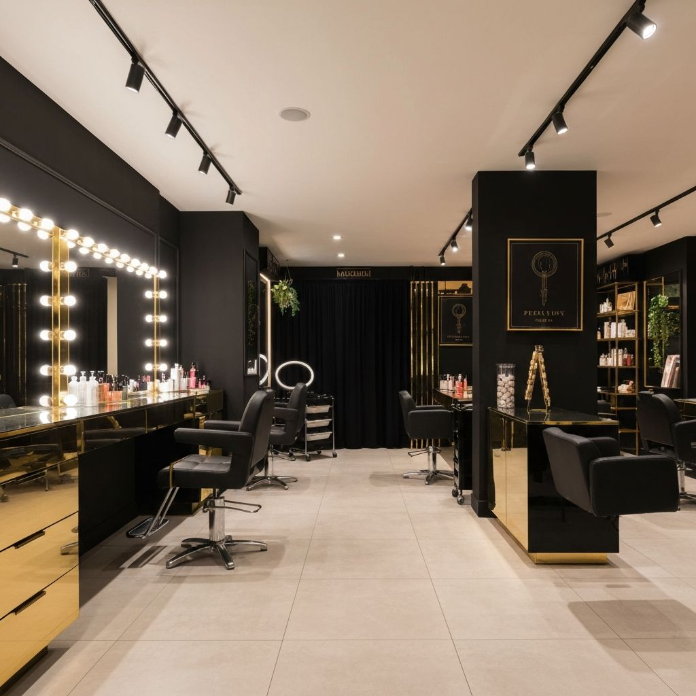
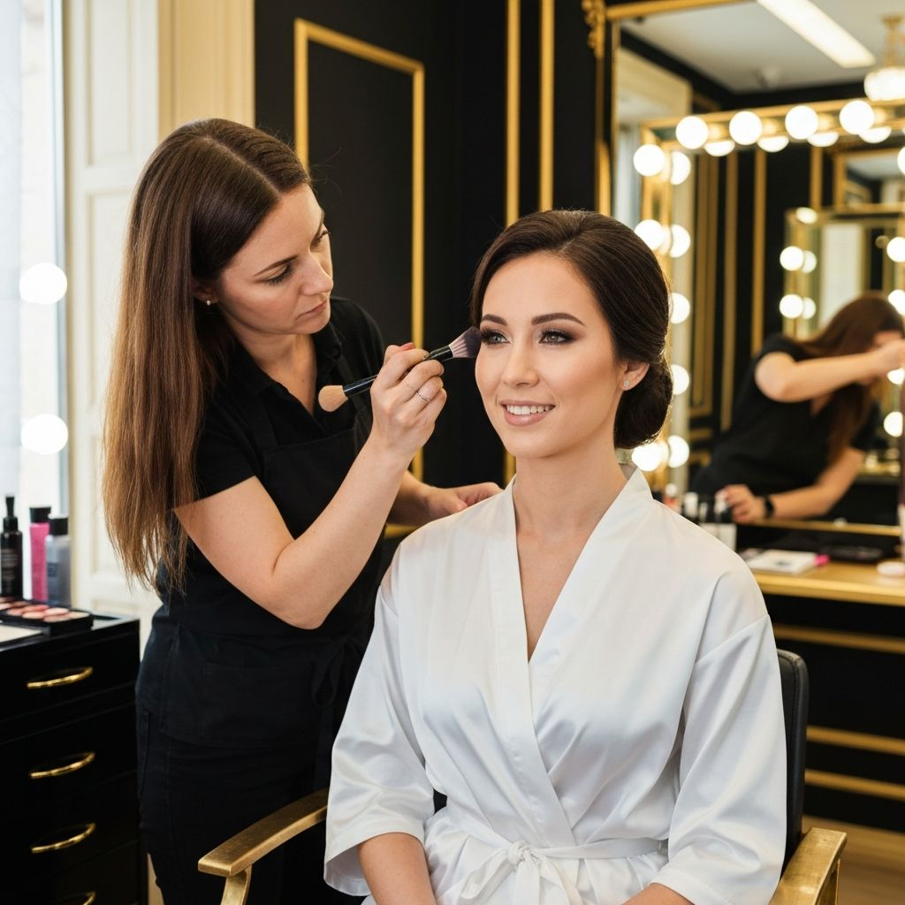
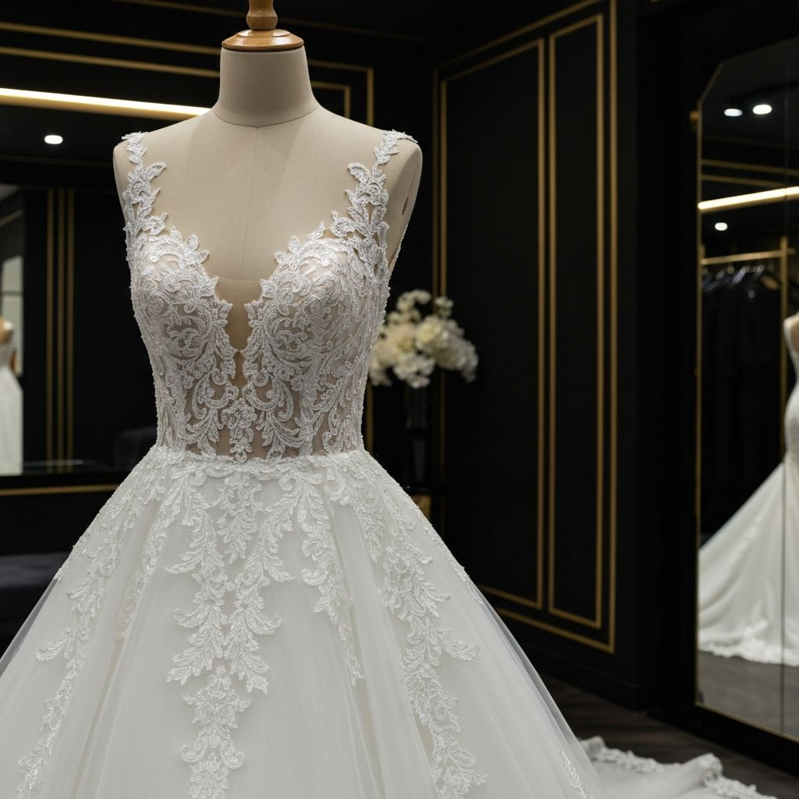

# Al-Malika Atelier & Beauty Center

A bilingual marketing site for a premium salon — dark gold interiors, a services menu, a dress gallery, and a booking CTA that feels like the brand.

## Who it’s for

Salon and atelier owners who want a public site that looks like the room — Arabic-first, English a tap away — so brides and walk-in clients can browse the look, then actually book.

## What you can do

- Browse bridal makeup, hair, skincare, nails, lashes, brows, henna, and party looks in one services grid
- Flip through the atelier dress gallery (view-only, so the gowns stay the star)
- Book from the homepage or contact form — WhatsApp, a call, or a request with a preferred time
- Switch Arabic ↔ English without the layout falling apart
- Show the work: salon floor, finished looks, and gowns instead of a generic template

## Try it

The live site is at **[queen-beauty-center.vercel.app](https://queen-beauty-center.vercel.app)**.

## How it works

Four public pages — home, services, dresses, and contact — with AR/EN copy in one dictionary and CTAs that go to the form or WhatsApp. Images ship with the repo, so the gold-and-black look stays fast and on-brand.

---

Built by [Ziad Ahmed](https://github.com/Ziad-NasrEldin) at [MaVoid](https://mavoid.com).

[Website](https://mavoid.com) · [LinkedIn](https://linkedin.com/in/ziad-ahmed-634202332) · [GitHub](https://github.com/Ziad-NasrEldin)
